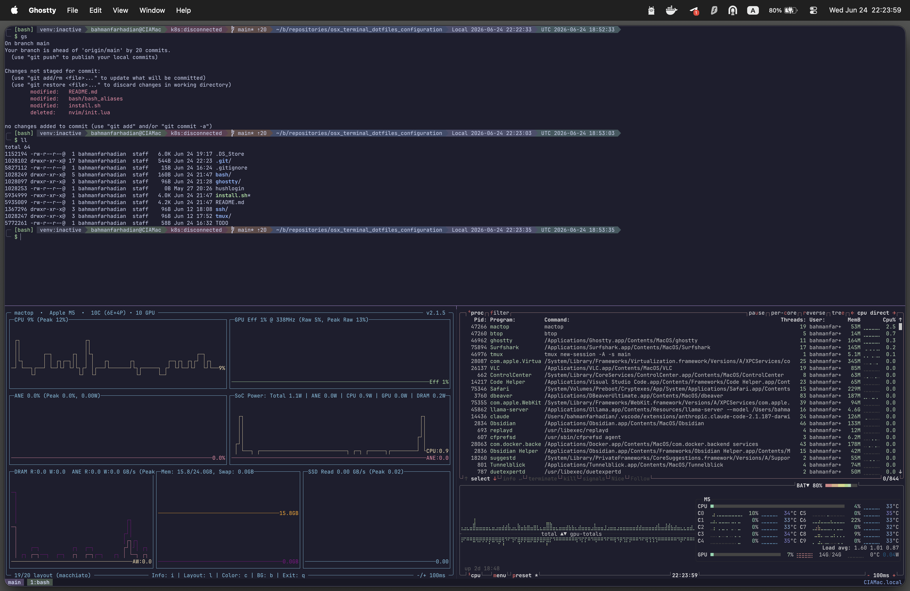

# dotfiles

macOS dotfiles for **bash**, **tmux**, and **Ghostty** — Catppuccin Mocha theme throughout.

---

## Screenshot



---

## Layout

```
dotfiles/
├── bash/
│   ├── bash_profile   → ~/.bash_profile
│   ├── bashrc         → ~/.bashrc
│   └── bash_aliases   → ~/.bash_aliases
├── tmux/
│   └── tmux.conf      → ~/.tmux.conf
├── ghostty/
│   └── config         → ~/.config/ghostty/config
├── ssh/
│   └── config         → ~/.ssh/config.d/dotfiles
├── install.sh
└── hushlogin          → ~/.hushlogin
```

---

## Prerequisites

```bash
# Homebrew
/bin/bash -c "$(curl -fsSL https://raw.githubusercontent.com/Homebrew/install/HEAD/install.sh)"

# Required tools
brew install bash bash-completion@2 coreutils tmux git git-lfs gh vim \
             btop jq yq curl wget tree

# Ghostty — download .dmg from ghostty.org
# Nerd Font (for prompt glyphs)
brew install --cask font-jetbrains-mono-nerd-font
```

---

## Deploy

```bash
./install.sh   # idempotent — safe to re-run
exec bash      # reload current session
```

The script copies each managed dotfile into place and sets bash as the default shell
for both your user and root. It will ask whether to configure root — enter `y`
and your sudo password, or press Enter to skip root.

If `~/.bash_aliases` already exists, the installer preserves it and only
upserts the marked GNU Coreutils section it owns. This is also how root's alias
file is handled when root configuration is selected.

SSH settings are written to `~/.ssh/config` — stale blocks from previous installs are replaced automatically, fresh installs append.

> **Remove all zsh customisations** (reverts to macOS defaults — does not uninstall zsh):
> ```bash
> rm -f ~/.zshrc ~/.zsh_aliases ~/.zsh_history
> rm -rf ~/.zsh_sessions
> exec zsh
> ```

---

## Root user

Root prompt turns red. macOS defaults root to `/bin/sh` — change it first:

```bash
sudo dscl . -create /Users/root UserShell /bin/bash
sudo cp bash/bash_profile /var/root/.bash_profile
sudo cp bash/bashrc       /var/root/.bashrc
sudo cp bash/bash_aliases /var/root/.bash_aliases
sudo cp tmux/tmux.conf    /var/root/.tmux.conf
```

---

## Prompt

```
─ [bash]  venv:name  user@host  k8s:cluster  branch*⇡1  ~/path  Local ...  UTC ...
$
```

Git badge suffixes: `*` unstaged · `+` staged · `⇡N` ahead · `⇣N` behind · `{N}` stashes.  
`k8s:` shows `kubectl config current-context` — red when disconnected.  
`venv:` shows the active virtualenv name, or `venv:inactive` when none is active.

| Segment | Background |
|---|---|
| `venv:name` | Mauve `#52476a` |
| `venv:inactive` | Overlay `#353748` |
| `user@host` | Green `#475950` (Red `#5e3f53` for root) |
| `k8s:` connected | Sky `#3e5767` |
| `k8s:disconnected` | Red `#5e3f53` |
| git branch | Peach `#604b49` |
| not git repo | Overlay `#353748` |
| path | Blue `#3e4b6b` |
| Local time | Lavender `#4b4e6c` |
| UTC time | Teal `#415960` |

---

## tmux

| Keys | Action |
|---|---|
| `Shift+←` / `Shift+→` | Previous / next window |
| `Option+W/A/S/D` | Pane focus (no prefix) |
| `Ctrl+b` + `h/j/k/l` | Pane focus (prefix) |
| `Ctrl+b` + `"` | Create a stacked pane; all pane heights are equalized |
| `Ctrl+b` + `x` | Close a pane; remaining pane heights are equalized |
| `Ctrl+d` | Exit the shell; remaining local pane heights are equalized |
| `fn+↑` / `fn+↓` | Enter / scroll copy-mode |
| `q` / `Esc` | Exit copy-mode |
| `Ctrl+b @` | Toggle synchronize-panes — borders turn red |
| `Ctrl+b $` | Rename session |
| `Option+1–5` | Even-H / Even-V / Main-H / Main-V / Tiled |
| `Option+6` / `Option+7` | Next / previous layout |
| `F12` | Toggle nested-tmux passthrough; Option/Alt layout and pane keys are forwarded to the remote tmux |

---

## Aliases

| Alias | Action |
|---|---|
| `c` / `reload` | clear / restart shell |
| `t` | tmux |
| `v` | vim |
| `pubkey` | print + clipboard first SSH public key |
| `password` | random base64-48 string |
| `pubip` / `privip` | external / private IP |
| `cpy` | pipe filter — `cmd 2>&1 \| cpy` prints and copies output |

**GNU Coreutils (macOS):** Homebrew's `coreutils` `gnubin` directory is placed
first in `PATH`, so GNU/Linux names work without the `g` prefix—for example
`timeout`, `sha256sum`, `readlink`, `stat`, and `sort`.

**Git:** `g gs ga gaa gc gca gco gcob gb gl gd gds gp gpf gpl gpr gst gstp gstl gf grb gcp gwip`

**Python:** `py pip piv va vd pipi pipr pipff jn jl`

**Docker:** `d dps dpsa di dex dlogs dstop dstart dprune dc dcu dcd dcl dcr dcb`

**Kubernetes:** `k kgp kgpa kgs kgn kgd kdes kdp kds kdn klogs kex kap kdel kctx kuse kns krun`

---

## SSH

`ssh/config` is appended to `~/.ssh/config` (re-running replaces any stale block). Settings: `IdentityFile ~/.ssh/id_ed25519`, `Port 22`, `StrictHostKeyChecking no`, `UserKnownHostsFile /dev/null`, `AddKeysToAgent 5m` (caches passphrase for 5 min, matching `sudo`'s default window).
